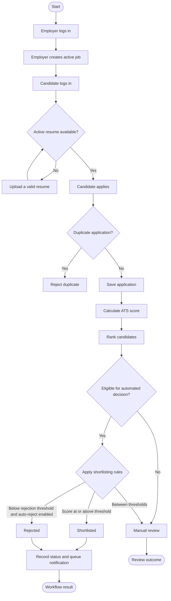

# Recruitment Workflow

```mermaid
flowchart TD
    A([Start]) --> B[Employer logs in]
    B --> C[Employer creates active job]
    C --> D[Candidate logs in]
    D --> E{Active resume available?}
    E -- No --> X[Upload a valid resume]
    X --> E
    E -- Yes --> F[Candidate applies]
    F --> G{Duplicate application?}
    G -- Yes --> H[Reject duplicate]
    G -- No --> I[Save application]
    I --> J[Calculate ATS score]
    J --> K[Rank candidates]
    K --> L{Eligible for automated decision?}
    L -- No --> M[Manual review]
    L -- Yes --> N{Apply shortlisting rules}
    N -- Score at or above threshold --> O[Shortlisted]
    N -- Below rejection threshold and auto-reject enabled --> P[Rejected]
    N -- Between thresholds --> M
    O --> Q[Record status and queue notification]
    P --> Q
    M --> R([Review outcome])
    Q --> S([Workflow result])
```
